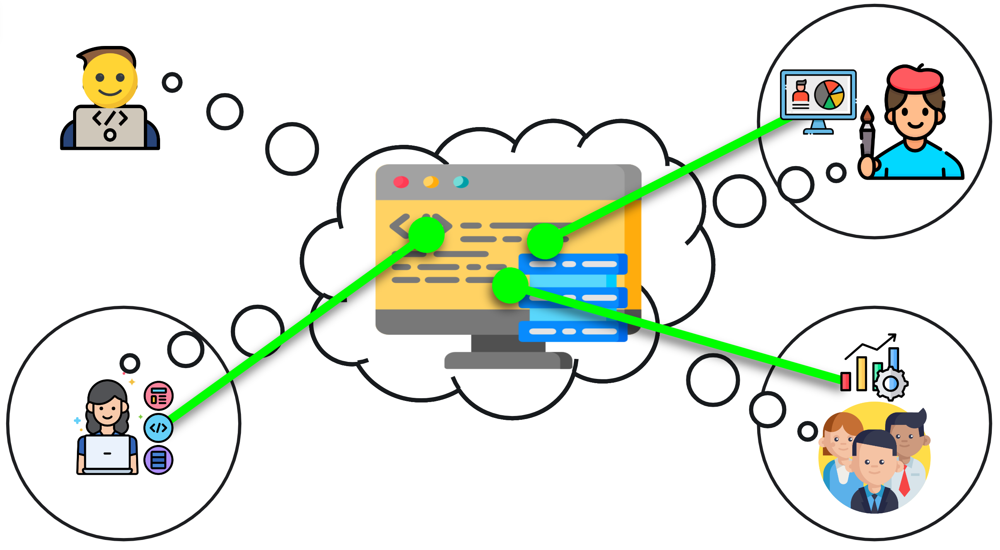

# Introduction

## Exercise
> **Good vs. Bad Code**
> 
> Grab some sticky notes and write down **what makes code good or bad for you personally** and place it on the whiteboard.

## Bad Code

* Bad code requires mental mapping between the outside world and the internals of the code because the internal structure of the software does not match the outside world.
* With every iteration, this mental work increases, which decreases team productivity continuously.

## Good Code
* Good code on the other hand minimises the mapping between the outside world and the internals of the code.
* The outside world is represented in code using appropriate, human-readable abstractions.
* Productivity stays high from start of software creation to its phase-out.
* In the best case, everybody involved in the creation of the software (also business, customer, users, POs, ScMs, etc.)
share the same mental model (so called Ubiquitous Language in Domain-Driven Design)

## How to identify code to improve?

* a systematic approach to identify code with improvement potential are [Code Smells](https://refactoring.guru/refactoring/smells).
* Code Smells are micro-anti-patterns in code that indicate something may be wrong.
* Not every code smell actually is a problem.

## Exercise
> **Identifying Code Smells**
>
> Have a look at the print out of RoundedShape
> * 5 mins - mark (optionally name) as many smells as possible
> * 3 mins - merge findings with your neighbour (we will tell you when to switch)

## Objective of this (tiny) workshop

* Recognise the most important code smells
* Apply automated and manually refactorings
* Evaluate goal designs

## Design Principles as Orientation for the Design Goal in typical Business Software 
From most to least important
1. Separation of Concerns (e.g. Clean Architecture, Layering, Model View Controller, CQRS)
2. Single Responsibility Principle
3. Keep it Simple Stupid (KISS), You Ain't Gonna Need It (YAGNI)
4. Principle of Least Surprise
5. Single Level of Abstraction
6. Don't Repeat Yourself (DRY)
7. Cycle-free
8. Prefer Composition over Inheritance
9. OLID (Open-Closed, Liskov Substitution Principle, Interface Segregation Principle, Dependency Inversion Principle)
10. Program against an interface, not an implementation
11. Gang of Four Design Patterns

## How 
