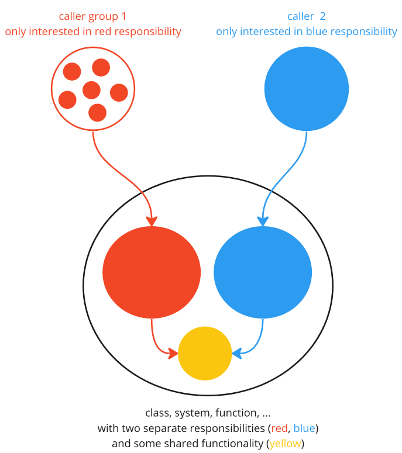
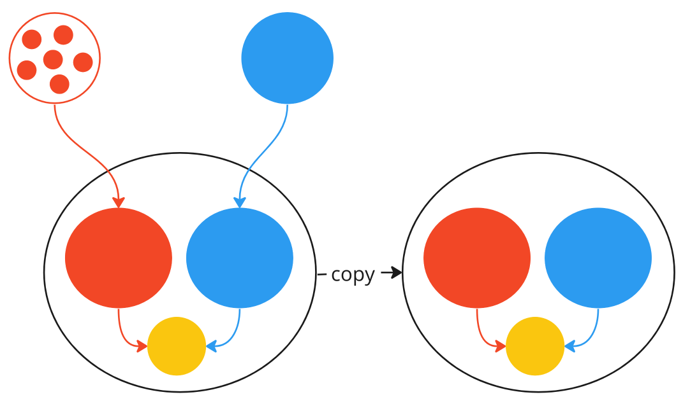
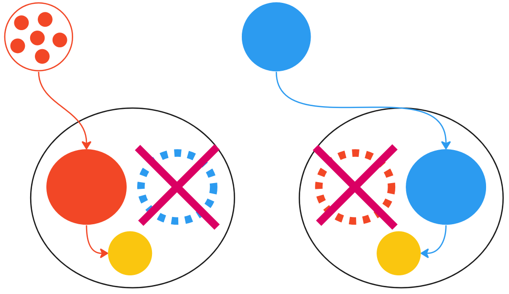
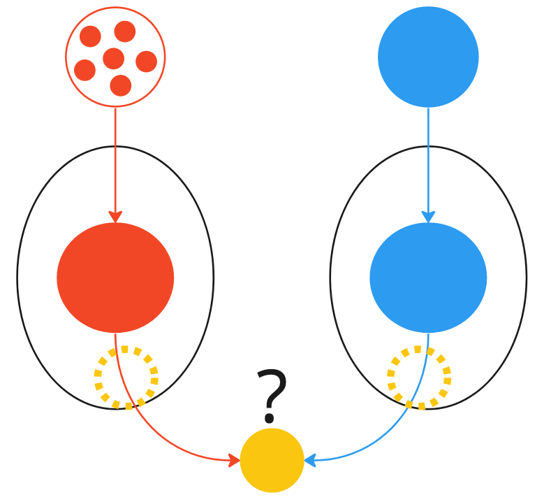

# Duplicate and Reduce
0. A structure (e.g. class, function, loop, system) with multiple callers or caller groups, which each are only interested in 1 of the 2 or more responsibilities the structure has.

1. For each caller or caller group of a structure, create an own copy

2. Redirect each caller or caller group to their respective copy of the structure.

3. Reduce the copy to only work on the single responsibility the caller or caller group is interested in.

4. (Optional) if it makes sense, extract the initially shared part into an own structure and call it from the other structures.

This algorithm is both extremely simple yet scales from function to system level easily.
