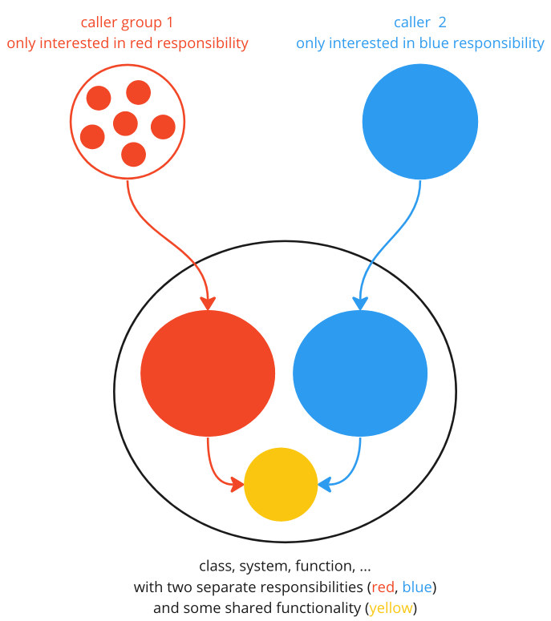
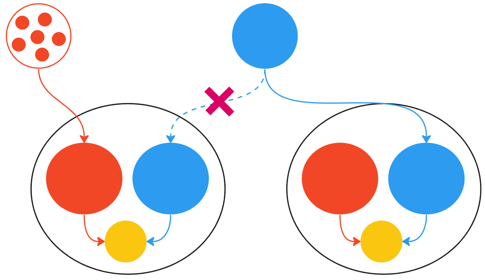
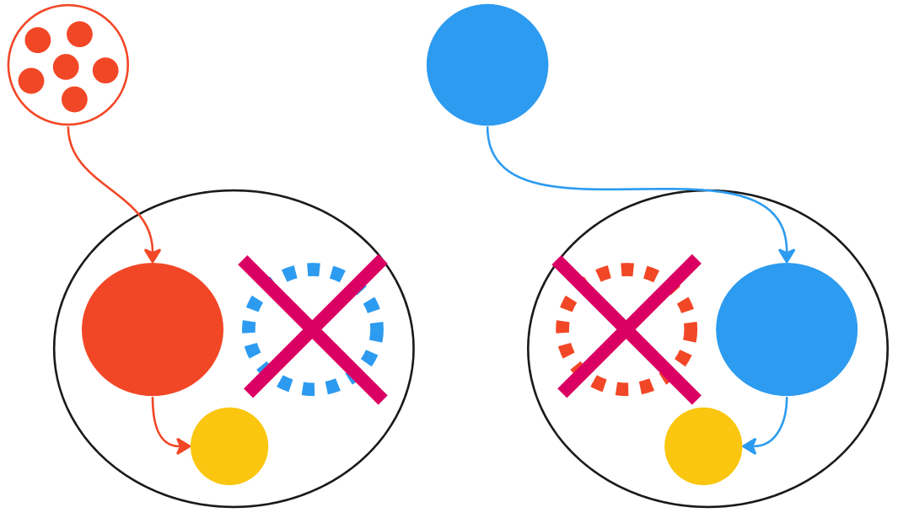
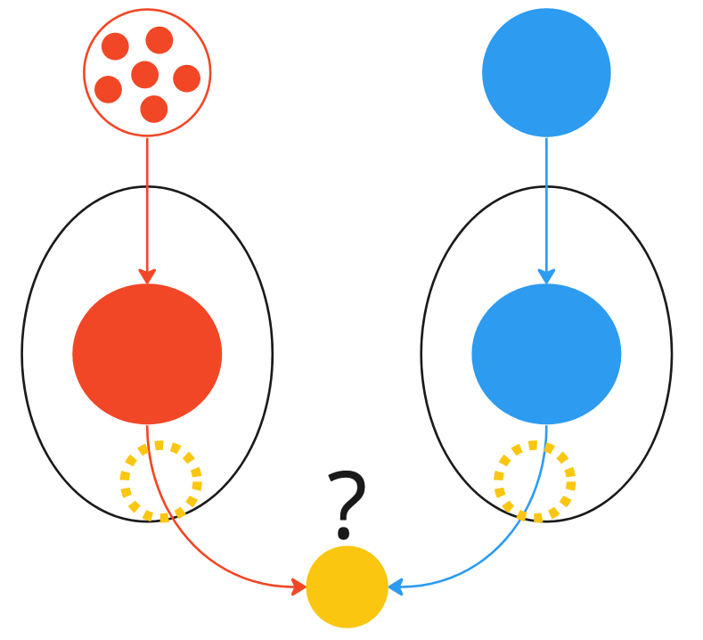

# Long Method
> Exercise branch: **exercise6**
>
> Solution branch: **exercise7**
>
> **Exercise part 1**
> 
> The “contains” method still uses x and y coordinates instead of the Point class! However, if we introduce a parameter for it in “contains”, we end up with two unrelated concerns in the loop of countContainedPoints:
> * Concern 1: validation of point input values and creation of points
> * Concern 2: counting the number of points contained within the circle.
> 
> Thus, 
> * Wrap the parameters x and y of the “contains” method in the existing Point record. 
> * Split the loop into two separate loops:
>  * Loop 1 creates a list of Points with a Point for each xCoords[i] and yCoords[i]
>  * Loop 2 iterates over this list of points and counts points contained within the circle.
> 
> 
>  *Side note*: you can also try out “Duplicate & Reduce” to split the loop in two.
> 
> **Exercise part 2**
> 
> Creation of points (including validation of inputs) should happen outside of “countContainedPoints” as it is not in the responsibility of that method.
> * Wrap the loop for creating points into a static method “createPoints(xCoords, yCoords)” 
> * Make this method public and move it to a new class PointsFactory 
> * Wrap the loop for counting points into a public method “countContainedPoints(List<Point>)” 
> * Remove PointsFactory.createPoints(xCoords, yCoords) from this method (either use inline refactoring or extract parameter)

## Long Method / Function

### Explanation
- Long Method / Function is difficult to understand or name accurately.

### Illustration
- too limited space :)

### Reason
- The method might be so lengthy that it requires scrolling or places a cognitive load on the reader who has to remember various parts of the method to fully comprehend it.
- The method often violates the Single Responsibility Principle (SRP) and the "as it tries to perform several unrelated but entangled tasks at once. This typically leads to non-descriptive or general names that do not encompass all the responsibilities of the method.

### Remedies
- Create a consolidated method with a single level of abstraction by segregating several sub-methods with meaningful names that reflect their functions.
- Comments in the code often suggest potential segments for segregation.
- The process of extracting parts of the method can provide benefits such as facilitating the transfer of parts to other/new classes, enabling unit testing, and promoting reuse.

### Origin of the Smell
- Over time, existing methods were continuously extended to accommodate new requirements without adding new abstractions.
- The absence of proper understanding of object-oriented design often leads to procedural programming on basic data structures.

### Exceptions - When is it Justifiable?
- Long Methods / Functions containing simple, direct logic without any branching (for example, mappings or protocol filling) are generally acceptable.

## Loop Split
### Precondition
A loop with several responsibilities / concerns, where initially a given data holder is created and that is used for many different, independent calculations.

### Example
#### Before the split
````java
// calculate fee, frequent renter points, and document to display in front end
int frequentRenterPoints = 0;
String result = "Rental Record for " + customer.getName() + "\n";
double totalAmount = 0;

for (int i = 0; i < rentBooksRequests.size(); i++) {
    // concern 1: create rental
    var rentalData = rentBooksRequests.get(i).split(" ");
    var bookId = Integer.parseInt(rentalData[0]);
    
    Book book = bookRepository.findById(bookId);
    var daysRented = Integer.parseInt(rentalData[1]);
    Rental rental = new Rental(book, daysRented);
    
    // concern 2: calculate frequent renter points
    frequentRenterPoints += rental.getFrequentRenterPoints();
    
    // concern 3: create figures for this rental
    result += "\t'" + rental.getBookTitle() + "' by '" + rental.getBookAuthors() + "' for " + rental.getDaysRented() + " days: \t" + rental.getAmount() + " $\n";
    
    // concern 4: calculate total amount
    totalAmount += rental.getAmount();
}
````

#### After
```java
// calculate fee, frequent renter points, and document to display in front end
int frequentRenterPoints = 0;
String result = "Rental Record for " + customer.getName() + "\n";
double totalAmount = 0;

var rentals = new ArrayList<>();

// concern 1: create and add rental to a list in the first loop.
for (int i = 0; i < rentBooksRequests.size(); i++) {
    final String[] rentalData = rentBooksRequests.get(i).split(" ");
    
    int bookId = Integer.parseInt(rentalData[0]);
    Book book = bookRepository.findById(bookId);
    
    int daysRented = Integer.parseInt(rentalData[1]);
    Rental rental = new Rental(book, daysRented);
    rentals.add(rental);
}

// concern 2: calculate frequent renter points
for(Rental rental: rentals){
    frequentRenterPoints += rental.getFrequentRenterPoints();
}

// concern 3: create figures for this rental
for(Rental rental: rentals){
    result+="\t'"+rental.getBookTitle()+"' by '"+rental.getBookAuthors()+"' for "+rental.getDaysRented()+" days: \t"+rental.getAmount()+" $\n";
}

// concern 4: calculate total amount
for(Rental rental: rentals) {
    totalAmount += rental.getAmount();
}
```
1. Identify and separate concerns into collocated blocks of code within the initial large loop
2. In the first loop, create a list of the objects that are used for various calculations
2. For every concern, add an individual loop (e.g. a foreach)
3. Move every concern to its own loop
4. Optional: wrap each loop into its own method and move it to an own file or class

### Control Flow Split
- The Loop Split algorithm of duplicating the control structure is also feasible for other control structures (e.g. if, switch) with several separate concerns in the body.
- identifying different concerns and duplicating the control flow structure for each concern enables the extraction of methods with only one purpose and a single responsibility.
- Simple, small methods/functions that can be moved close to the data they use (or into a class) are the main driver of a rich, understandable, extensible domain model and maintainable software design.

## Duplicate and Reduce
1. For each caller or caller group of a structure (class, function, loop, system), create an own copy (copy-paste)


2. Redirect each caller or caller group to their copy of the structure.

3. Reduce the copy to only work on the single responsibility the caller or caller group is interested in.

4. (Optional) if it makes sense, extract the initially shared part into an own structure and call it from the other structures.


This algorithm is both extremely simple yet scales from function to system level easily.

## Emerging Software Design Algorithm
Extension of **extract, wrap, move**.
1. Separate responsibilities within the method (e.g. using Loop Split or Duplicate and Reduce)
2. **Extract private method / function**
3. Remove direct access to non-required fields of the old class or types
4. **Wrap target state with domain-specific class or type**
5. **Move method to the target class as public or as a function in a file close to the domain type**
6. Simplify parameters to remove unwanted dependencies
